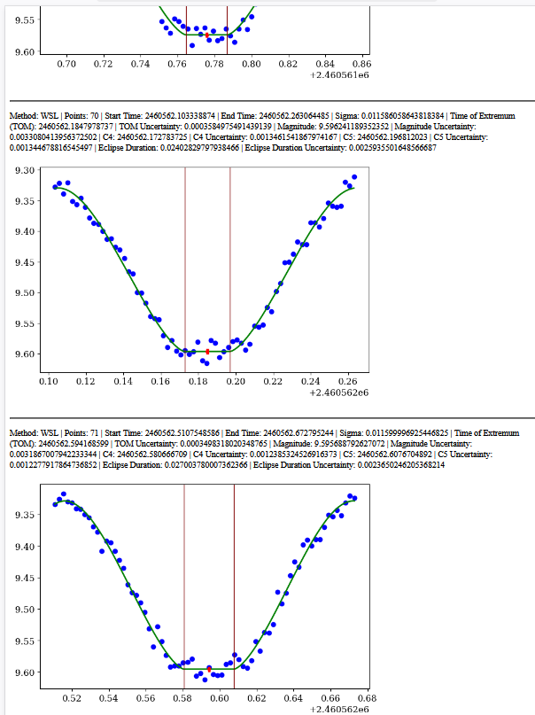

Python scripts to approximate light curves with different approximation methods.
See, for example:

Andrych, Kateryna D.; Andronov, Ivan L.; Chinarova, Lidia L.
MAVKA: Program of Statistically Optimal Determination of Phenomenological Parameters of Extrema. Parabolic Spline Algorithm And Analysis of Variability of The Semi-Regular Star Z UMa
Journal of Physical Studies, Vol. 24, No. 1, Article 1902 [10 pages] (2020)
Bibcode: 2020JPhSt..24.1902A
DOI: 10.30970/jps.24.1902, 10.48550/arXiv.1912.07677

-------------------------------------------------------------------------------

Usage:

See examples (.bat files on Windows and .sh scripts on Linux)

1. ila_ap.py: Python script used to perform light curve approximations.
   Use ila_ap.py -h to display help.

2. split_lc.py: an auxiliary script to generate a file with time intervals for the batch mode approximation.

-------------------------------------------------------------------------------
-------------------------------------------------------------------------------

